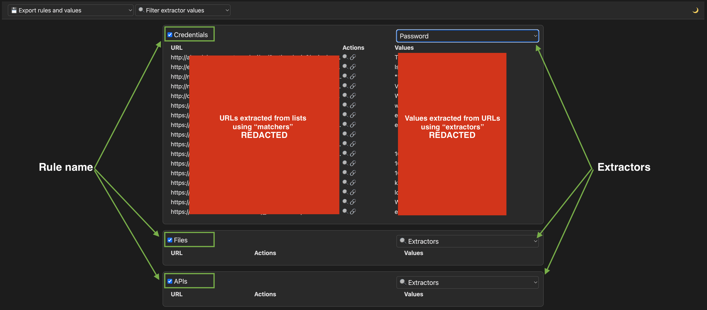

# Crawling Report
Create an interactive HTML report from a list of URLs to help identifying interesting URLs based on configurable rules. 

Run: **run.py \<arg\>**  
**Arguments:**
- get-config: Create a copy of config.yaml in **/app/out**
- create-report: Generate the HTML report in **/app/out**. Use cached results (if they exist).
- create-report-no-cache: Generate the HTML report in **/app/out**. Ignore cached results.
If no argument is specified, it prints out the help.

## How To (Dockerized version)
1) Create a config.yaml file and put it in the same directory of run.sh.
2) Edit run.sh and modify the volumes pointing to /app/in (Input folder) and /app/out (Output folder).
3) Run run.sh

The input folder **/app/in** must contain at least one file that contains a list of URLs (one per line).
The tool will process every file (it uses **cat** and **grep** commands).  
After processing, the tool will produce an HTML report in the output folder **/app/out** along with its dependencies (JS and CSS files).

## Templates
Files are in the template folder: **/app/template**.  
It's possible to edit HTML, JS and CSS files without rebuilding, by adding a volume that points to /app/template.

# Configuration (config.yaml)
The configuration file must have the following structure:
```yaml
max_rows_per_report: 500
rules:
  - name: "Credentials"
    enabled: true
    matchers:
      # Users and passwords
      - "[\\?|&](passw|pwd|password|passwd|username|user|usr|login|loginid)=[^&]"
    extractors:
      - name: "Password"
        group: 2
        expression: "(passw|pwd|password|passwd)=([^&]+)"
```

The first key is **max_rows_per_report**.  
This key defines the max number of rows per each report.  
When a report reaches the maximum number of pages, a new report is created.  
On the top-left corner of the page, a dropdown menu allows to change "page" (or report).  

Under **rules** we have:
- **name**: The name of the rule
- **enabled**: A boolean that defines whether the rules is enabled or not. If the rules is NOT enabled, it will be ignored and won't be added to the report.
- **matchers**: A list of regular expressions used with the **grep** command (grep -iE '\<regexp\>') for extracting URLs from lists that match the regular expressions.
- **extractors**: A list of extractors that define regular expressions in **JavaScript**, in the HTML report. The extractors are used for extracting values from single URLs.  

The structure of an extractor is the following:
- **name**: The name of the extractor.
- **group**: The ID of the group defined in the expression that contains the value to be shown.
- **expression**: The regular expression

A group in a regular expression is defined by using parentheses.

## Config Example
Let's say we have the following URLs:
```
matcher: [\\?|&](passw|pwd|password|passwd|username|user|usr|login|loginid)=[^&]

URLs:
https://evil-site.com/login.php?user=guest&password=Passw0rd!
https://evil-site.com/search.php?id=1
```

The **matcher** defined above will match the first URL only.
After creating the HTML report, the extractor "Password" will match a specific pair of parameter/value:
```
extractor expression: (passw|pwd|password|passwd)=([^&]+)

extracted values:
group 0: password=Passw0rd!
group 1: password
group 2: Passw0rd!
```

Since the value of **group** in the YAML file is **2**, in our report we will have the value **Passw0rd!** under the column **Values**.  
We can specify the group **0** if we want our report to display both the parameter and its value.



# Caches
Caches will be saved in the output folder, under a subfolder named **cache**.  
Caches are divided by rules: each rule is saved to a file named **RuleName.cache**.  

After processing a matcher for a specified rule, caches are saved in JSON format.  
If a matcher is already processed, it will be skipped.

Changing **extractors** will **NOT** affect caches, so it's possible to add, remove or modify extractors and generate a new report without processing files again. 

Use the argument **create-report** if you want to use the caches.  
Use the argument **create-report-no-cache** if you want to ignore the caches.  

# Paging
When the maximum number of rows per report is reached, new reports are created.  
The first report will be named "report_DATETIME_0.html", the second "report_DATETIME_1.html" and so on. 
Based on how many reports are going to be generated, the last part of the filename will change the format.  
- <= 9 reports generated: report_DATETIME_x.html (e.g., 0, 1, 2...)
- \>= 10 and <= 99 reports: report_DATETIME_xx.html (e.g., 01, 02, 10, 11, 99...)
and so on.

Each file represents a single page that can be changed by selecting it on the top-left dropdown menu.

# Example
On our host we have two folders:
- **/home/kali/report/input** as our input folder
- **/home/kali/report/output** as our output folder

1. Edit the **run.sh** file and modify the following volumes:
```bash
change
-v "$(pwd)/sample_input":"/app/in"
-v "$(pwd)/sample_output":"/app/out"

to
-v "/home/kali/report/input/":"/app/in"
-v "/home/kali/report/output/":"/app/out"
```

2. Edit the **config.yaml** to add, remove or modify rules.  
3. Create a list of URLs (you can do it manually or create it using tools such as **waybackurls** or **Katana**) and save it in the input folder.  
4. Run the script **run.sh**
5. Open the HTML report in the output folder.

HTML reports can be exported in TXT and CSV formats.  
**Exported files will contain only visible rows.**  

# TODO

# Task completed
- [x] Add the possibility to display all the values extracted by the extractors.  
Example:  
**URL**: https://evil-site.com/login.php?user=guest&password=Passw0rd!&passwd=Passw2!  
**Extractor expression**: (passw|pwd|password|passwd)=([^&]+)  
**Current behavior**: the value **Passw0rd!** is extracted but **Passw2!** is ignored.  
**Desired behavior**: all the values must be extracted.  
- [x] Implement caching
- [x] Implement paging
- [x] Implement enable/disable rule
- [x] Implement a function to allow users choosing domain name to show and to hide
- [x] Allow a user to choose if rows without values are shown or hidden by default (via config file)
- [x] Implement a search bar in the report